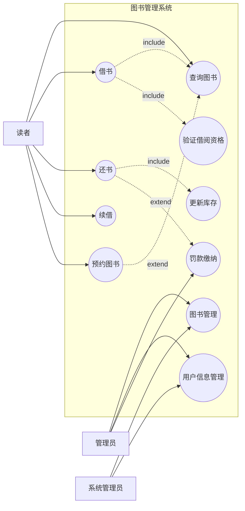
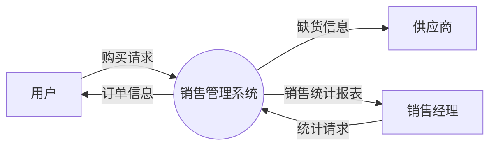
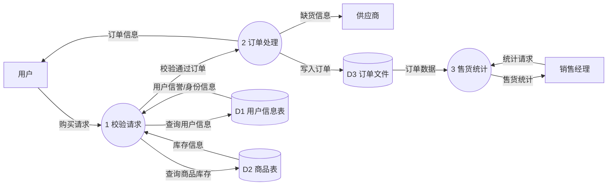
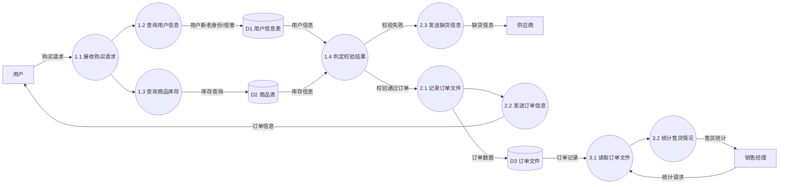

# 2024年同等学力申硕软件工程真题详细解答

## 一、填空题解答（6分）

1. **答案：** 应用软件、系统软件、支持软件
   **解析：** 根据软件的功能和用途，软件可以分为应用软件（为特定应用领域开发的软件）、系统软件（管理计算机资源的软件）和支持软件（辅助软件开发和维护的软件）。

2. **答案：** 代码结构
   **解析：** 白盒测试也称为结构测试，它基于程序的内部结构和逻辑进行测试，需要了解代码的内部实现。

3. **答案：** 功能需求
   **解析：** 黑盒测试也称为功能测试，它基于软件的外部功能需求进行测试，不关心内部实现细节。

## 二、选择题与判断题解答（14分）

### 选择题解答（10分）

1. **答案：C**
   **解析：** 封装性是面向对象方法中实现信息隐蔽的核心特性，通过封装可以将对象的内部实现细节隐藏起来。

2. **答案：A**
   **解析：** 类是对象的模板或蓝图，对象是类的实例。

3. **答案：D**
   **解析：** 敏捷过程模型是渐进性开发过程，强调快速迭代和响应变化。

4. **答案：E**
   **解析：** 4+1视图模型包括逻辑视图、开发视图、进程视图、物理视图、场景视图。

5. **答案：B**
   **解析：** WBS是Work Breakdown Structure的缩写，即工作分解结构。

### 判断题解答（4分）

1. **答案：正确**
   **解析：** 编程风格确实会影响程序的运行效率，良好的编程风格有助于提高代码质量和性能。

2. **答案：错误**
   **解析：** 信息隐蔽是通过封装性实现的，而不是继承性。

3. **答案：错误**
   **解析：** 敏捷开发更强调可工作的软件胜过详尽的文档。

4. **答案：错误**
   **解析：** 软件测试的目标是发现错误，而不是证明程序没有错误。

## 三、画图题解答（10分）

**答案：**
1. **主要参与者（Actor）：**
   - 读者
   - 管理员
   - 系统管理员

2. **主要用例（Use Case）：**
   - 用户注册、登录
   - 图书查询
   - 图书借阅
   - 图书归还
   - 续借
   - 罚款缴纳
   - 图书管理（采购、删除、修改）
   - 用户信息管理

3. **关系：**
   - 读者可以执行图书查询、借阅、归还、续借等用例
   - 管理员可以执行图书管理和用户信息管理
   - 图书查询用例可能扩展为预约图书功能

4. **关系标识：**
   - 实线连接参与者与用例
   - 虚线箭头标注<<include>>表示包含关系
   - 虚线箭头标注<<extend>>表示扩展关系

**用例图：**

## 四、综合分析题解答（15分）

**答案：**

1. **顶层DFD：**
   - 外部实体：客户、供应商、销售经理
   - 系统：销售管理系统
   - 数据流：购买请求、订单信息、缺货信息、统计请求、销售统计结果

2. **0层DFD：**
   - 加工：处理客户请求、验证请求、处理订单、统计销售
   - 数据存储：用户信息表、商品表、订单文件
   - 数据流：购买请求→验证→订单生成→处理订单

3. **1层DFD：**
   - 详细分解各加工：
     * 验证请求：查询用户信息、查询商品库存
     * 处理订单：发送订单信息、生成缺货通知

4. **各层DFD的作用和特点：**
   - 顶层：展示系统与外部实体的交互关系
   - 0层：展示系统内部的主要功能模块
   - 1层：详细描述各功能模块的内部处理逻辑

**顶层DFD：**

**0层DFD：**

**1层DFD：**
