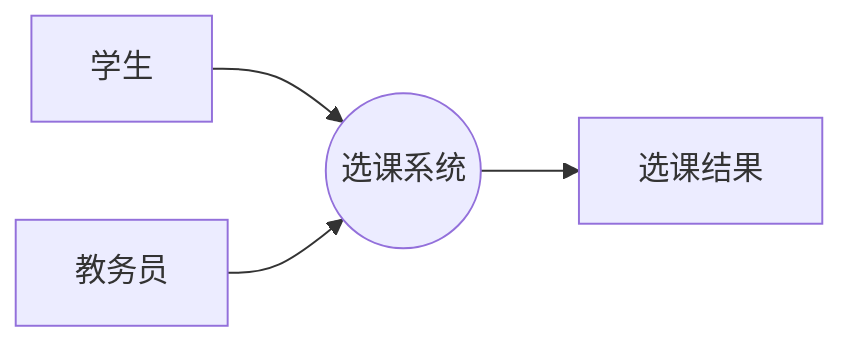
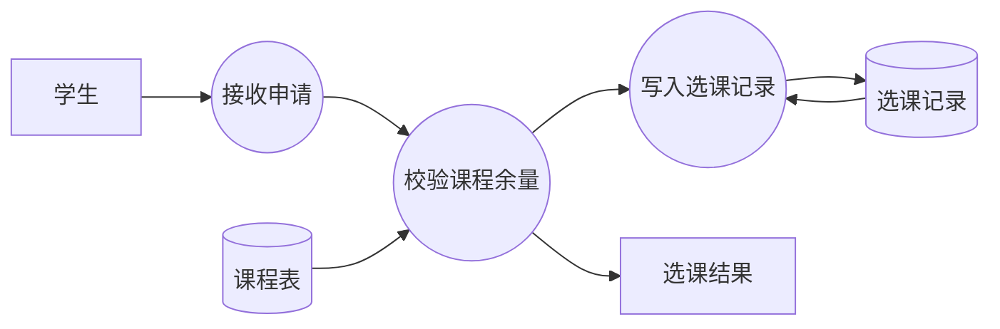
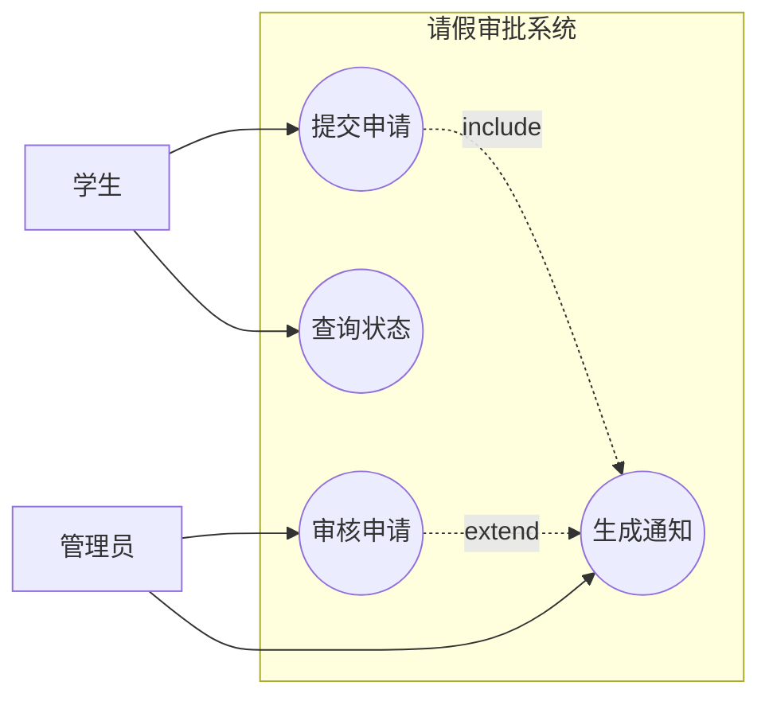
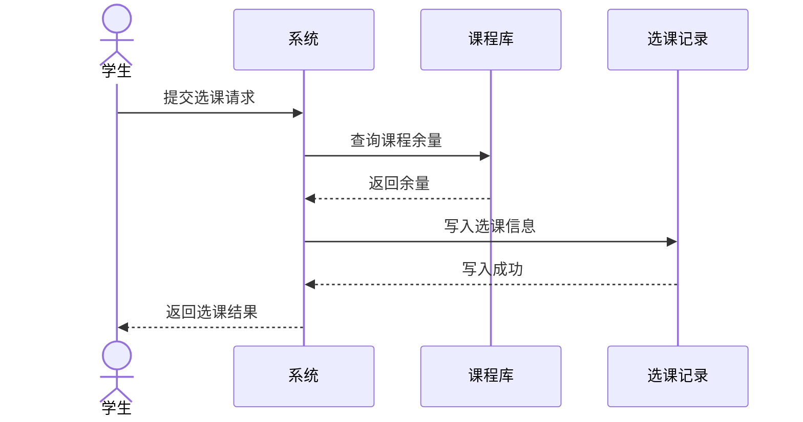
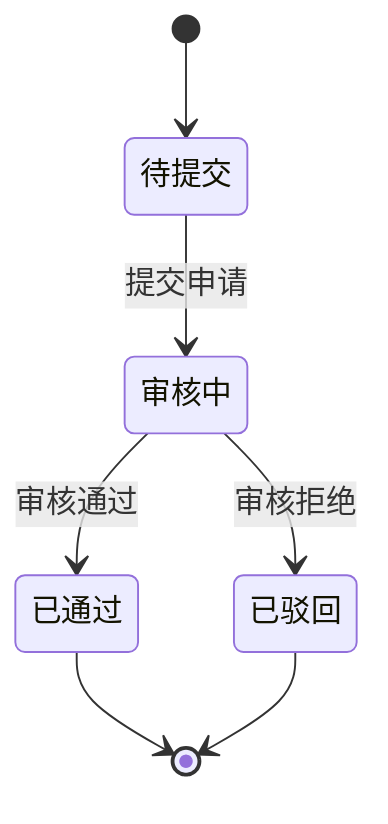

# 软件工程考前速背：拿分图示版

> 适用场景：明天直接背，用来抢客观题、简答题和建模题的步骤分。
>
> 背诵原则：先背能直接套的模板，再背图怎么画，最后背少量扩展点。

## 一、第一眼先记住的总原则

- 软件工程考题里，最常见的是“概念 + 对比 + 模板 + 图示”。
- 选择题先认定义，简答题先写模板，建模题先列元素再画图。
- 题目不会时，至少把定义、分类、步骤、作用写出来，步骤分通常就有。

## 二、S 级：必须拿下

### 1. 软件过程与生命周期模型

#### 1.1 软件生存周期过程三大类

- 基本过程：获取、供应、开发、运行、维护
- 支持过程：配置管理、质量保证、验证、联合评审、审计、问题解决
- 组织过程：过程管理、基础设施管理、改进管理、培训等

#### 1.2 生命周期模型一口气背完

| 模型 | 核心特点 | 适合场景 |
|---|---|---|
| 瀑布模型 | 阶段顺序推进，文档驱动 | 需求稳定、变更少 |
| 增量模型 | 分批交付可用子系统 | 先快出一部分功能 |
| 演化模型 | 原型不断演进完善 | 需求不清、边做边改 |
| 螺旋模型 | 风险驱动、迭代开发 | 大型复杂、高风险项目 |
| 喷泉模型 | 面向对象、阶段重叠、反复迭代 | OO 开发、强调并行 |

#### 1.3 最容易考的对比

- 增量模型：分批交付功能，强调“先做一部分再补全”。
- 演化模型：系统不断演进，强调“边做边改、逐步完善”。
- 螺旋模型：每一轮都先做风险分析，再决定下一步。
- 喷泉模型：阶段可重叠、可回流，常与面向对象开发联系在一起。

#### 1.4 直接可背答法

“软件生命周期模型是软件开发各阶段组织方式的抽象。瀑布模型顺序推进，增量模型分批交付，演化模型逐步完善，螺旋模型以风险驱动，喷泉模型强调面向对象开发中的阶段重叠与反复迭代。”

---

### 2. 需求工程与需求规约

#### 2.1 需求工程四件事

1. 需求获取
2. 需求分析
3. 需求规格说明
4. 需求验证与需求管理

#### 2.2 需求分类

- 功能需求：系统“做什么”
- 非功能需求：性能、可靠性、安全性、可维护性等
- 约束需求：技术、法律、进度、预算等约束

#### 2.3 SRS 必背质量要求

- 完整性：没有重要遗漏
- 一致性：前后不矛盾
- 无歧义性：一句话只有一种理解
- 可验证性：能用测试或评审验证
- 可修改性：易于更新
- 可追踪性：能追到设计、实现和测试

#### 2.4 需求发现技术

- 面谈
- 问卷
- 观察
- 原型法
- 场景 / 用例分析
- 文档分析

#### 2.5 需求规约常见结构

- 引言
- 总体描述
- 具体需求
- 附录

#### 2.6 直接可背模板

“需求工程包括需求获取、分析、规格说明、验证和管理。需求规格说明书应满足完整性、一致性、无歧义性、可验证性、可修改性和可追踪性。”

---

### 3. 软件测试：白盒、黑盒、测试目标、覆盖准则

#### 3.1 测试目标

- 发现缺陷
- 证明软件有错的可能性，而不是证明软件绝对正确
- 提高质量信心

#### 3.2 黑盒 vs 白盒

| 项目 | 黑盒测试 | 白盒测试 |
|---|---|---|
| 依据 | 需求规格说明 | 程序内部逻辑 |
| 关注 | 输入输出、功能 | 语句、分支、路径 |
| 看什么 | 外部行为 | 内部结构 |
| 典型方法 | 等价类、边界值、判定表、因果图 | 语句覆盖、分支覆盖、路径覆盖 |

#### 3.3 覆盖率公式

$$
\text{覆盖率}=\frac{\text{已覆盖对象数}}{\text{总对象数}}\times 100\%
$$

常见覆盖：

- 语句覆盖 = 已执行语句 / 总语句
- 分支覆盖 = 已执行分支 / 总分支
- 路径覆盖 = 已执行路径 / 总路径

#### 3.4 黑盒测试高频方法

- 等价类划分：把输入分成若干等价类，选代表值
- 边界值分析：重点测边界点和边界附近
- 判定表：条件多、组合多时特别好用
- 因果图：把输入原因和输出结果对应起来

#### 3.5 白盒测试高频方法

- 语句覆盖
- 分支覆盖
- 条件覆盖
- 路径覆盖

#### 3.6 直接可背模板

“黑盒测试关注输入输出和功能是否符合需求，白盒测试关注程序内部结构和控制流。测试的目标是发现缺陷、提高质量信心，而不是证明程序没有错误。”

---

### 4. 建模题：DFD、用例图、时序图、状态图

#### 4.1 DFD 怎么画

##### 元素

- 外部实体：矩形，系统外的对象，如用户、管理员、供应商
- 处理：圆或圆角矩形，表示加工、变换、处理
- 数据存储：开口矩形或双线，表示文件、数据库
- 数据流：箭头，表示数据的流向

##### 画图步骤

1. 先确定外部实体
2. 再确定系统边界和主要处理
3. 再找数据存储
4. 最后补数据流箭头
5. 分层时注意“平衡原则”：上下层输入输出要对应

##### DFD 层次怎么理解

- 顶层图 / 环境图：只画系统和外部实体
- 0 层图：分解成主要处理
- 1 层图：继续细化某个关键处理

##### DFD 直接示意

顶层图先只画系统与外部实体：

0 层图再把系统分解为主要处理：

##### DFD 答题模板

“先写外部实体，再写系统处理，再写数据存储，最后连数据流。若题目要求分层，则顶层只画系统与外界的交互，0 层分解为主要处理，1 层进一步细化关键处理。”

---

#### 4.2 用例图怎么画

##### 元素

- 参与者 Actor：系统外的角色，如学生、教师、管理员
- 用例 Use Case：系统提供的功能，用椭圆表示
- 系统边界：一个大矩形，把所有用例包起来

##### 关系

- 关联：参与者和用例之间的实线
- include：必然复用的公共功能，虚线箭头指向被包含用例
- extend：条件触发的扩展功能，虚线箭头指向基础用例

##### 画图步骤

1. 先找参与者
2. 再找主要功能用例
3. 再判断哪些是 include，哪些是 extend
4. 最后画系统边界

##### 用例图示意

##### 用例图答题模板

“先确定参与者，再确定系统功能用例，最后标明 include 和 extend 关系。用例图重点不是画得漂亮，而是参与者、功能和关系方向正确。”

---

#### 4.3 时序图 / 顺序图怎么画

##### 元素

- 参与对象：放在上方，从左到右排列
- 生命线：对象下面的竖虚线
- 消息：对象之间的水平箭头
- 激活条：对象正在处理时的细长矩形

##### 画图步骤

1. 先找参与对象
2. 再按时间顺序排列消息
3. 从上到下写请求与应答
4. 需要时标注激活条

##### 时序图示意

##### 时序图答题模板

“时序图按时间顺序描述对象之间的消息交互。绘制时先确定参与对象，再按先后顺序画消息箭头，消息从上到下排列，重点体现谁先调用谁、谁再返回结果。”

---

#### 4.4 状态图怎么画

##### 元素

- 初始状态：实心圆
- 状态：圆角矩形
- 转移：带事件名的箭头
- 终止状态：同心圆

##### 画图步骤

1. 找系统对象的稳定状态
2. 找触发状态变化的事件
3. 画初态、状态、终态
4. 给箭头标注事件 / 条件 / 动作

##### 状态图示意

##### 状态图答题模板

“状态图描述一个对象在生命周期内因事件驱动而发生的状态变化。绘制时先找初态、终态和关键状态，再按事件画状态迁移箭头。”

---

## 三、A 级：直接决定你能不能从 18 分拉到 23 分

### 1. 软件设计基础：总体设计、详细设计、结构化与面向对象

#### 1.1 总体设计和详细设计

- 总体设计：决定系统怎么分模块、模块怎么连接
- 详细设计：决定模块内部怎么实现

#### 1.2 结构化方法

- 核心思想：自顶向下、逐步求精
- 常见分析：变换分析、事务分析
- 常见结果：模块结构图

#### 1.3 面向对象方法

- 核心对象：类、对象、属性、方法、消息
- 核心特性：封装、继承、多态、抽象

#### 1.4 变换分析和事务分析

- 变换分析：输入 → 变换中心 → 输出
- 事务分析：有一个事务中心，根据不同路径分支处理

#### 1.5 直接可背模板

“总体设计决定模块划分和模块间关系，详细设计决定模块内部算法和数据结构。结构化方法强调自顶向下和逐步求精，面向对象方法强调对象、封装、继承与多态。”

---

### 2. 软件工程管理：WBS、成本进度估算、风险管理

#### 2.1 WBS

WBS = Work Breakdown Structure，工作分解结构。

#### 2.2 成本估算常见方法

- 专家判断
- 类比估算
- 自底向上估算
- LOC / FP 估算
- COCOMO 估算

#### 2.3 COCOMO 常见公式

$$
E=a\times(KLOC)^b
$$

$$
T=c\times(E)^d
$$

其中：

- $E$ 表示工作量
- $T$ 表示开发时间
- $KLOC$ 表示千行代码规模

#### 2.4 风险管理步骤

1. 风险识别
2. 风险分析
3. 风险排序
4. 风险应对
5. 风险监控

#### 2.5 风险常见表达

$$
\text{风险} \approx \text{概率} \times \text{影响}
$$

#### 2.6 直接可背模板

“WBS 是把项目工作逐层分解成可管理任务的方法。软件成本估算可用专家判断、类比、LOC、FP 或 COCOMO；风险管理包括识别、分析、排序、应对和监控。”

---

### 3. 软件质量与质量保证

#### 3.1 软件质量是什么

- 软件满足规定功能和用户需求的程度
- 既看产品，也看过程

#### 3.2 常见质量特性

- 功能性
- 可靠性
- 易用性
- 效率
- 可维护性
- 可移植性
- 安全性
- 兼容性

#### 3.3 质量保证活动

- 质量计划
- 过程评审
- 技术评审
- 审计
- 测试
- 缺陷跟踪
- 配置管理

#### 3.4 直接可背模板

“软件质量是软件满足功能和非功能需求的程度。软件质量保证强调过程控制和产品检查，常见活动包括质量计划、评审、审计、测试、缺陷跟踪和配置管理。”

---

### 4. CMM 五级模型

#### 4.1 五级名称

1. 初始级
2. 可重复级
3. 已定义级
4. 已管理级
5. 优化级

#### 4.2 一眼记住的含义

- 初始级：过程混乱，靠个人经验
- 可重复级：能把成功经验重复出来
- 已定义级：过程已标准化并文档化
- 已管理级：有度量、有监控
- 优化级：持续改进、不断优化

#### 4.3 常考关键过程域

可重复级常考：

- 需求管理
- 软件项目计划
- 软件项目跟踪与监督
- 软件配置管理
- 软件质量保证
- 软件子合同管理

已定义级常考：

- 组织过程定义
- 组织过程焦点
- 培训程序
- 软件产品工程
- 组间协调
- 同行评审

#### 4.4 直接可背模板

“CMM 的五级从初始到优化，反映软件过程成熟度逐步提高。可重复级重在重复成功经验，已定义级重在标准化，已管理级重在度量和控制，优化级重在持续改进。”

---

## 四、B 级：有余力再补

### 1. 模块耦合与内聚

#### 1.1 内聚从低到高

偶然内聚 → 逻辑内聚 → 时间内聚 → 过程内聚 → 通信内聚 → 顺序内聚 → 功能内聚

口诀：偶逻时过通顺功

#### 1.2 耦合从低到高

无直接耦合 → 数据耦合 → 特征耦合 → 控制耦合 → 公共耦合 → 内容耦合

口诀：无数特控公内

#### 1.3 直接可背模板

“内聚越高越好，耦合越低越好。内聚表示模块内部元素相关程度，耦合表示模块间依赖程度。”

---

### 2. CASE 分类与集成化环境

#### 2.1 CASE 是什么

CASE = Computer-Aided Software Engineering，计算机辅助软件工程。

#### 2.2 常见分类

- 上 CASE：支持分析、设计
- 下 CASE：支持编码、测试、维护
- 集成 CASE：覆盖软件生命周期多个阶段

#### 2.3 集成化 CASE 环境

- 工具之间数据共享
- 过程统一
- 版本统一
- 形成一体化开发环境

#### 2.4 直接可背模板

“CASE 是计算机辅助软件工程工具。按支持阶段可分为上 CASE、下 CASE 和集成 CASE；集成化 CASE 环境强调工具集成、数据共享和过程统一。”

---

### 3. 软件维护类型

#### 3.1 四种维护

- 改正性维护：修错误
- 适应性维护：适环境变化
- 完善性维护：加功能、提性能
- 预防性维护：为将来故障做改进

#### 3.2 直接可背模板

“软件维护是交付后对软件进行修改和改进。常见类型有改正性、适应性、完善性和预防性维护。”

---

### 4. 4+1 视图、常见架构风格

#### 4.1 4+1 视图

- 逻辑视图：功能结构
- 开发视图：开发模块组织
- 过程视图：运行时并发与进程
- 物理视图：部署结构
- 场景视图：典型用例场景

#### 4.2 常见架构风格

| 架构风格 | 核心特点 | 适合场景 |
|---|---|---|
| 分层架构 | 层次清楚、职责分离 | 管理信息系统 |
| C/S 架构 | 客户端和服务器分工 | 传统业务系统 |
| MVC | 模型、视图、控制器分离 | Web 应用 |
| 管道-过滤器 | 数据流逐段处理 | 编译器、数据处理 |
| 微服务 | 服务拆分、独立部署 | 大型互联网系统 |

#### 4.3 直接可背模板

“4+1 视图从逻辑、开发、过程、物理和场景五个角度描述系统架构；常见架构风格包括分层、C/S、MVC、管道-过滤器和微服务。”

---

## 五、最后一页：考场直接抄的答题句

### 1. 软件过程与生命周期

“软件生命周期模型是软件开发各阶段的组织方式。瀑布模型顺序推进，增量模型分批交付，演化模型逐步完善，螺旋模型风险驱动，喷泉模型强调面向对象开发中的迭代与并行。”

### 2. 需求工程

“需求工程包括获取、分析、规格说明、验证和管理。SRS 需要完整、一致、无歧义、可验证、可修改、可追踪。”

### 3. 测试

“黑盒测试看功能和输入输出，白盒测试看内部结构和控制流。测试目标是发现缺陷并提高质量信心。”

### 4. DFD

“先写外部实体，再写处理，再写数据存储，最后补数据流。顶层图画系统与外界，0 层图分解主要处理，1 层图继续细化关键处理。”

### 5. 用例图

“先找参与者，再找主要用例，再标 include 和 extend 关系，最后画系统边界。”

### 6. 时序图

“时序图按时间顺序描述对象间消息交互，参与对象从左到右排列，消息从上到下排列。”

### 7. 状态图

“状态图描述对象在生命周期内因事件触发而发生的状态变化。先找初态、状态和终态，再画转移箭头。”

### 8. 软件设计

“总体设计决定模块划分和模块间关系，详细设计决定模块内部算法和数据结构。结构化方法强调自顶向下，面向对象方法强调封装、继承和多态。”

### 9. 管理与质量

“WBS 是工作分解结构；成本估算可用类比、LOC、FP、COCOMO；风险管理按识别、分析、排序、应对、监控进行；质量保证强调过程控制与产品检查。”

### 10. CMM

“CMM 五级从初始到优化，体现软件过程成熟度逐步提高。可重复级重在重复成功经验，已定义级重在标准化，已管理级重在度量，优化级重在持续改进。”